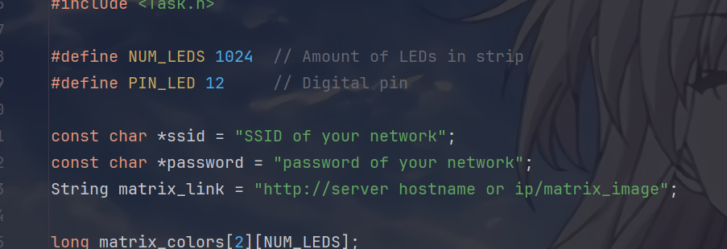
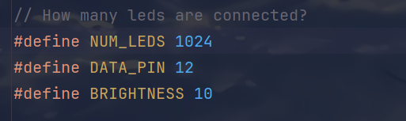
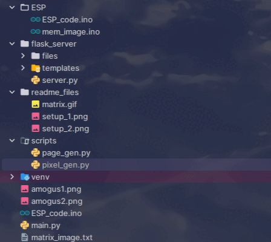
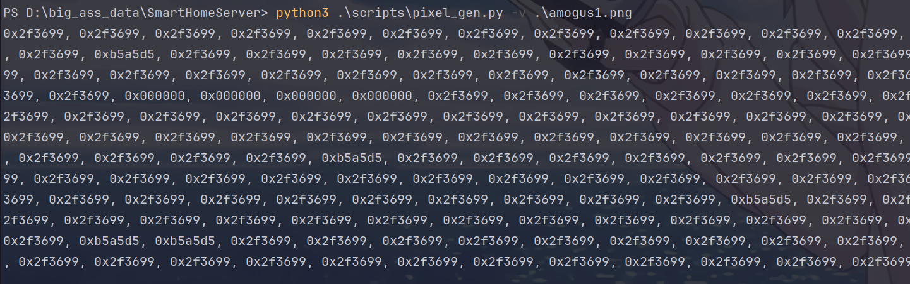
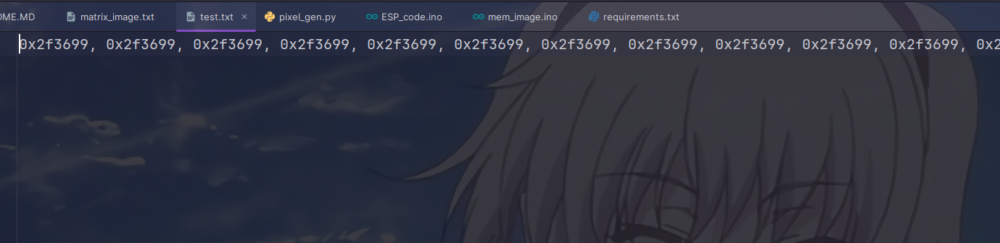
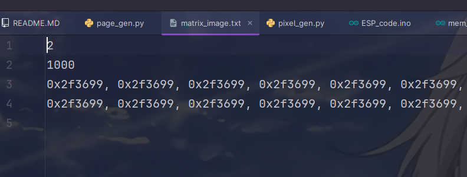
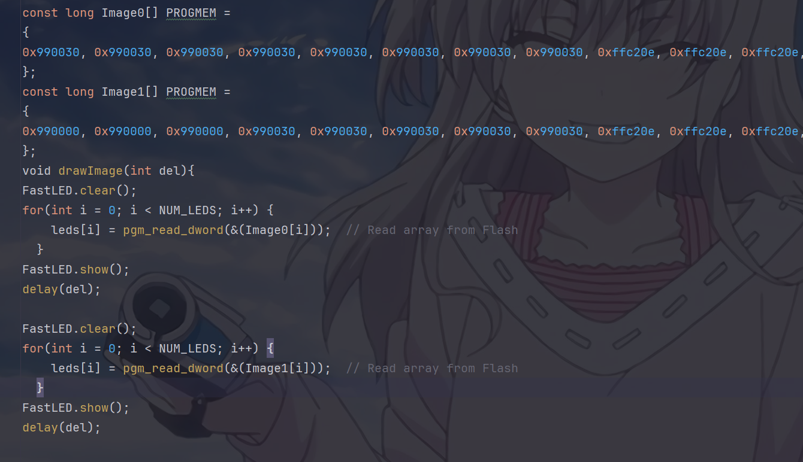
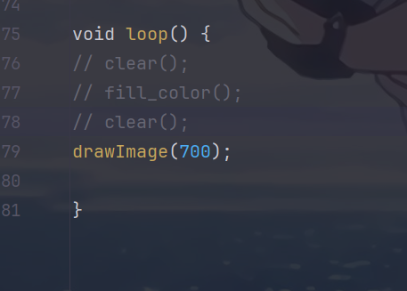

Matrix Image
============

This is my pet project of LED matrix, powered by ESP8266 and flask.


### There are few important files:

- **scripts/pixel_gen.py:** Pixel generator from image
- **scripts/page_gen.py:** Page generator from list of images
- **flask_server/server.py:** A simple flask server for ESP8266
- **ESP/ESP_code.ino:** Code for ESP8266 to get image from server
- **ESP/mem_image.ino:** If you don't want to use server, you can diplay image from ESP's memory

---

## What do you need to build this project

1. ESP8266 type board ([aliexpress](https://aliexpress.ru/item/1005006318918275.html))
2. LED matrix panels, i used 4 of 8x32 panels ([aliexpress](https://aliexpress.ru/item/4001296811800.html))
3. Some 5v power adapters

---

## Setup

Software

1. pip install -r requirements.txt
2. You need to install [ArduinoIDE](https://www.arduino.cc/en/software) and setup ESP boards (you can
   use [that tutorial](https://randomnerdtutorials.com/how-to-install-esp8266-board-arduino-ide/)).
   Also, you have to install FastLed library.
3. Configure variables in .ino code
   If you decided to use server version



If you decided to use memory version



Hardware

1. Solder GND pin of Jst connector to GND pin of ESP
2. Solder Data pin of Jst connector to D6 pin of ESP
3. Solder another Jst connector
4. Solder Matrix plates together (DOUT from previous panel goes to DIN of next panel)
5. Solder power cables from power adapter to last panel (you can have a mutual power if your matrix is small size)
6. Connect ESP to matrix
7. Upload .ino code of your choice from ESP directory to ESP.

#### Jst connectors usually comes with LED panels. They obviously are not important for scheme.

---

# Usage

## Image processing

To correctly display your image, you have to make a 1-dimensional array of colors. There are 2 scripts to make that.

Unfortunately, i only made scripts for 32x32 matrix, that was made by 4x(8x32) plates, so if you have another size, you
have to modify my scripts.

### pixel_gen.py

#### Usage:

```bash
python3 pixel_gen.py args path_to_image
```

#### Arguments:

- -v, --visual: will show way of processing image, can help with debug



- -w filename, --write filename: if you want to write result to file
- -q, --quiet: with this flag result won't be printed in console(use with -w)

#### Result:

This script returns 1-dimensional array of colors

**Console output**


**File output**

---

### page_gen.py

#### Usage:

```bash
python3 page_gen.py args path_to_image_1 path_to_image_2
```

#### Arguments:

- -d, --delay: delay in ms between frames (default 1000)
- -f, --file: output filename (default matrix_image.txt)

#### Result:

This script returns a file in required format for server



---

## Server type

### matrix_image.txt structure

1. amount of frames (be carefull with that)
2. delay between frames in ms
3. pixel arrays, each with new tab


1. Put your matrix_image.txt file inside flask_server/files
2. Start server
    ```bash
    python3 .\flask_server\server.py
    ```
3. Paste server address inside ESP_code.ino's matrix_link variable
4. Upload sketch to ESP

## Important

#### Unfortunately, I couldn't use more than 2 images (ESP basically stopped parsing server's pages). So, be careful with amount of frames here.

## Memory type

1. Generate pixel arrays and paste them inside of mem_image.ino's Image variables.



2. Configure delay between frames in loop



3. You also can use other modes like rainbow and fill_color to test your matrix

---

## License

> You can check out the full license [here](https://github.com/TemiusIII/LED-matrix/blob/main/LICENSE)

This project is licensed under the terms of the **MIT** license.
